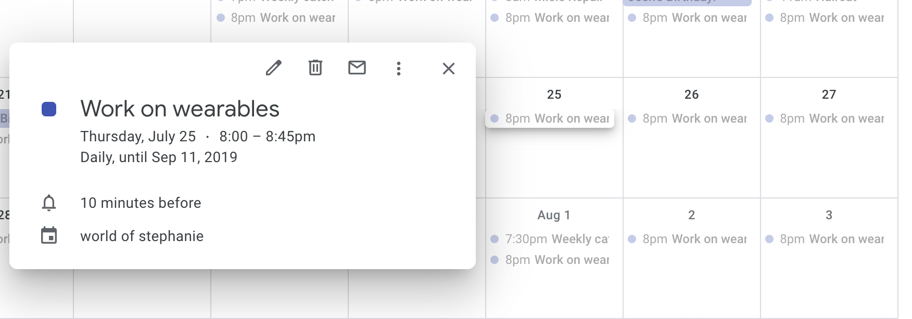
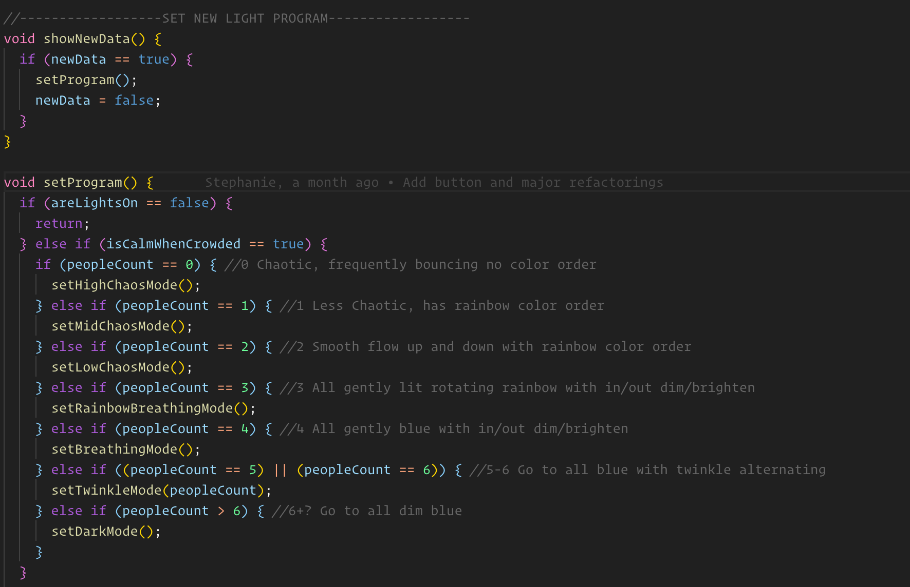

autoscale: true
footer: @stephaniecodes

# [fit] How not to read a room:

## [fit] Creating a socially awkward wearable

##  
##  

### Stephanie Nemeth

#### @stephaniecodes  ✨  stephanie.lol

[.hide-footer]

---

# I built an autonomous necklace

^ We are at a tech conf, and I'm to spend the next 30 minutes talking about my necklace

^ I still can't believe i built this thing and it works and looks cool.

^ So what is special about this necklace?

^ It's is responding to the number of people around me and adjusting its lighting to correspond with that. It may not be adjusting the way that you would expect, but I'll get to that in a bit.

---

# [fit] Loaded with tech

| Hardware | Software |
| :--- | :--- |
| Raspberry Pi | NodeJS |
| Arduino | TensorflowJS|
| Camera | C++
| LEDs
| Battery

^ How is it responding?

^ Well, as you can see in these 2 lists, I've utilized a lot of different tech to make this.

^ Hopefully, it is a surprise to see all this stuff listed since I hope that I have concealed all the bulky items that allow it to run well!

^ I have 2 main pieces hardware communicating together (rpi & arduino)

^ I have a camera attached to a rpi.

^ Multiple pieces of software - node and tensorflow js running a machine learning model on the pi tucked away on my midsection. This model is receiving the picture taken by the camera and running an image recognition model to identify what it sees.

^ After the ML model on the pi determines how many people it sees, it sends this info to the arduino.

^ I have the arduino running c++ code which then receives this info about it's surroundings and updates the colors and patterns of leds on the necklace based on parameters i've set for how it should respond.

^ FIGURE OUT A TRANSITION HERE

---

# Stephanie Nemeth

web developer, [@MicrosoftToDo](https://www.twitter.com/microsofttodo)

frontend  -  react  -  js  -  a11y

### ✨ Convo starters ✨
fashion  |  **vivienne westwood**  |  ootds

**bojack**  |  dogs

^ Hi, I'm stephanie.

^ i'm a frontend dev during the day.

^ i'm a tech fashion maker in my free time.

^ i love to talk about non-tech things, so I thought i'd include some convos starters if you see me around please chat!

---

### [fit] I'm *fascinated* with making myself 
### [fit] uncomfortable in public

^ I'm a bit introverted, awkward & anxious in social situations.
^ It's usually a guarantee that i'm uncomfortable in social settings.

---

# [fit] A wearable that forces me 
# [fit] to be *around people* in order to
# [fit] *not* DRAW ATTENTION

^ It's terrifying & counterinituitive but
^ EXPLAIN THIS SLIDE BETTER

---

# [fit] I've been evolving my exploration of this 
# [fit]topic without even realizing it

^ I've been exploring this topic in increasingly complex projects over the past couple years without even realizing it.

^ Increasingly curious of:

^ How people react in general

^ How I react to people reacting

---

### [tiny.cc/fiber-optic-kit](tiny.cc/fiber-optic-kit)

 

^ i was going to a festival and thought this is what you were supposed to do.

^ saw someone's work in a instructables tutorial and copied it exactly.

^ fiber optic whip kit

^ base is a flashlight with programmed programs

^ stitched to white dress sewn by my mom.
^ No coding, pre-programmed
^ No soldering, only sewing

---

## [fit] First time wearing lights 
## [fit] & people liked it!

---

## [fit] A Bit Lifeless

^ ~6 months coding experience
^ Next logical step was to actually code something

---

### [tiny.cc/haute-codeture](http://tiny.cc/haute-codeture)

 

^ Multiple coordinated pieces
^ Anyone on the web could control the lights
^ Lots of coding:
^React, NodeJS, MQTT, Arduino
^ Lots of soldering
^ Gave talks about this project last year, check out link

---

## People *really* liked controlling how I looked.

---

## *Limitations:*
## Dependent on wifi and an app

^ Stuck with keeping my phone on me, having a network connection

---

### [tiny.cc/speech-to-image](http://tiny.cc/speech-to-image)

^ Some coding:
^ NodeJS
^ Google cloud speech recognition API
^ Google Custom Search API
^ No soldering

---

# [fit] Responsive to the environment

# [fit] but needs wifi to work

---

# [fit] I accidently made something
# [fit] with *machine learning* & didn't realize it.

🤷‍

## (I just thought I was using an API)

---

# Making An Autonomous necklace

^ I've kind of misled you though.

^ I've shown the projects that I made before this and the progression of my work.

^ I honestly didn't realize how my work has built upon the topic of attracting human attention and how others and myself deal with that attention until I started writing this talk.

^ There is a definite moment when I decided to build this project.

---

### I couldn't keep up with a machine learning study group at work.

^But the real reason i built this is because I couldn't keep up with a machine learning study group at work that was doing a big MOOC course.

^ Everyone else learning fast
^ All theoretical no practical/tangible

^ Prove myself & Validate my learning style

---

^ NOTES

---

^ NOTES

---

## It was hard and
## I got demotivated

^ Build time: 8 months vs. 3 months

---

## I still know very little 
## about machine learning

---

## [fit] I'm good at figuring out things
## I don't understand

^ demotivated alot of this year
^ easy to hyperfocus and tweak one bit

---

<!-- [.build-lists: true]

# Autonomous Necklace Recipe

1. Get image recognition ML model running on **Node.js**
2. Run TensorFlow.js on **Raspberry Pi!**
3. Send camera pic to image recognition model on Raspberry Pi
4. Create a LED necklace
5. Send image data from the Raspberry Pi to the necklace
6. Make the necklace responsive to data

--- -->

# Autonomous Necklace Recipe

1. **Get image recognition ML model running on Node.js**
 
 
 
 
 

---

## TensorFlow.js

^ Library for training & running machine learning models in the browser
(or Node.js)

^ it's mostly geared towards the browser

---

# Tiny-YOLO

## *Y*ou *O*nly *L*ook *O*nce

- Pretrained model
- Fast **in-browser** image detection

---

# [fit] Adapt Tiny-YOLO to work on Node.js

- Use `@tensorflow/tfjs-node`
- Store model files locally
- Modify `import`/`export` statements
- Load image file vs. `MediaDevices.getUserMedia()`

---

# Autonomous Necklace Recipe

1. ~~Get image recognition ML model running on Node.js~~
2. **Run TensorFlow.js on Raspberry Pi!**
 
 
 
 

---

---

---

# FYI: I'm running on Tensorflow.js 0.14.2

It is a bit hacky, but runs reliable & that's beautiful!

 

If it ain't broke, don't fix it?

^ I did this months ago and honestly don't wanna mess it up

^ Latest tf.js release is 1.2.8

^ Also prepping rc 2.0

---

# Autonomous Necklace Recipe

1. ~~Get image recognition ML model running on Node.js~~
2. ~~Run TensorFlow.js on Raspberry Pi!~~
3. **Send camera pic to image recognition model on Raspberry Pi**
 
 
 

---

# [fit] Send camera pic to image recognition model on Raspberry Pi

- Hookup PiCamera 
- Use `node-canvas` & create a canvas for the pic
- Crop image to match what model expecting (416 x 416)
- Turn into a tensor & send to the model!

---

---

# Autonomous Necklace Recipe

1. ~~Get image recognition ML model running on Node.js~~
2. ~~Run TensorFlow.js on Raspberry Pi!~~
3. ~~Send camera pic to image recognition model on Raspberry Pi~~
4. **Create a LED necklace**
 
 

---

# [fit] Reuse hardware and materials I already had

---

---

 Use the blinkytiles but control them with an arduino

[https://github.com/jasoncoon/BlinkyTileFastLED](https://github.com/jasoncoon/BlinkyTileFastLED)

---

---

---

# Autonomous Necklace Recipe

1. ~~Get image recognition ML model running on Node.js~~
2. ~~Run TensorFlow.js on Raspberry Pi!~~
3. ~~Send camera pic to image recognition model on Raspberry Pi~~
4. ~~Create a LED necklace~~
5. **Send image data from the Raspberry Pi to the necklace**

---

# [fit] Physically connect the 
# [fit] Raspberry Pi to the necklace

---

^ Useful for low level communication
^ One for sending, one for receiving
^ Send data from Pi to data pin on Arduino

---

---

---

^ updating pi config files
^ disable some config settings on boot

---

# [fit] 🐛 Bugs :( 🐜

---

# [fit] Power issues on necklace

^ long wires
^ 5V possible, but with a bit of modification
^ Outside my abilities at the time
^ So switched boards instead

---

^ Teensy 3.3V, 5V tolerant
^ Metro Mini 5V output
^ Blinkytiles need 5V
^ I had one lying around

---

# [fit] Raspberry Pi Crashing

^ monitor with htop

---
[.build-lists: true]

# Remember this project?

---

# [fit] it was still running at startup 
# [fit] & HAD A MEMORY LEAK 
# 
# 🤦‍

---

# Autonomous Necklace Recipe

1. ~~Get image recognition ML model running on Node.js~~
2. ~~Run TensorFlow.js on Raspberry Pi!~~
3. ~~Send camera pic to image recognition model on Raspberry Pi~~
4. ~~Create a LED necklace~~
5. **Send image data from the Raspberry Pi to the necklace**

---

# [fit] What format do I use to send data?

---

# [fit] ‍I use json everywhere else,
# [fit] I'll use JSON here

---

[.build-lists: true]

# JSON on Arduino is a thing!

^ Hey, there's an Arduino JSON library

^ Wow, it worked!

---

# [fit] But this was a bad decision

---

^ Lights would pause while processing the JSON received

^ Oops, that didn't work so well

---

^ this is code in the NodeJS App
^ what info does the arduino really need
^ what can it be condensed down to
^ 60 & 62

---

^ actually started writing the C++ for the light programs at end of June

---

---

# Autonomous Necklace Recipe

1. ~~Get image recognition ML model running on Node.js~~
2. ~~Run TensorFlow.js on Raspberry Pi!~~
3. ~~Send camera pic to image recognition model on Raspberry Pi~~
4. ~~Create a LED necklace~~
5. ~~Send image data from the Raspberry Pi to the necklace~~
6. **Program the lights to change based on # of people around**

---

# [fit] Non-javascript stuff
### (Write a bunch of C++ on arduino)

---

---

[tiny.cc/ml-necklace](http://tiny.cc/ml-necklace)

---

^ Don't wait to the end to actually wear it

---

^ first idea was to stuffy everything in a fanny pack but that was not working.

^ too much stuff, too big

---

# [fit] Sometimes, I've had enough
## 
## 😖 😩 😫

^ I decided to add one more feature I hadn't planned for
^ a way to turn off the lights completely
^ ability to flip how the necklace responds

---

---

^ lots of bugs along the way
^ always stuff i could have done differently

---

## Thank you

^ lots of bugs along the way
^ always stuff i could have done differently