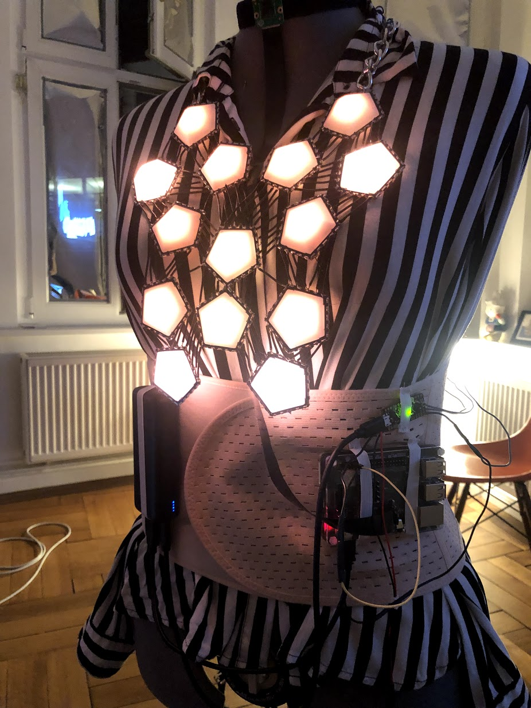

autoscale: true
footer: @stephaniecodes

# [fit] How not to read a room:

## [fit] Creating a socially awkward wearable

##  
##  

### Stephanie Nemeth

#### @stephaniecodes  ✨  stephanie.lol

[.hide-footer]

---

## Disclaimer:
## This is a tech talk about my necklace

^ next 30 minutes

^ using a lot of tech to respond people around me.

---

# [fit] Loaded with tech

| Hardware: | Software: |
| :--- | :--- |
| - Raspberry Pi | - NodeJS |
| - Arduino | - Tensorflow.js|
| - Camera | - C++
| - LEDs
| - Battery

^ Camera is taking a picture

^ Camera is attached to rpi

^ RPI is running NodeJS, tensorflowjs, image recognition model

^  ML model on the pi determines how many people it sees

^ sends info to an arduino.

^ The arduino is controlling the lights on the necklace.

^ it updates the colors and patterns of leds based on parameters i've set for how it should respond.

---
##### 

# Stephanie Nemeth

web developer, [@MicrosoftToDo](https://www.twitter.com/microsofttodo)

she/her

^ web dev

^ live in Berlin

---

### [fit] I'm *fascinated* with making myself
### [fit] uncomfortable in public

^ few yrs ago

^ started making lighted clothing

^ thought it beautiful.

^ Burden for me.

^ love them but hard to deal w/ the attention they draw

^ try to channel that anxiety into a fascination & excitement

^ use them to confront my discomfort of the attention they attract.

---

### [tiny.cc/fiber-optic-kit](tiny.cc/fiber-optic-kit)

 

^ the first project i ever made was...

^ festival

^ copied an instructables tutorial

^ bought a kit with preset light programs

^ sewed to a dress

---

## [fit] It was weird for me
## [fit] but people liked it

^ I felt awkward, but got lots of compliments.

^ Self-esteem boost.

^ wished it could be more alive & interactive

---

### [tiny.cc/haute-codeture](http://tiny.cc/haute-codeture)

 

^ Gave talks about this project last year, check out link

^  app to control the lights

^ Anyone on the web could change colors and patterns

^ Lots of coding: React, NodeJS, MQTT, Arduino

^ Lots of soldering

---

## [fit] a web app for your outfit is
## [fit] both good and bad

^ purposefully wanted to explore creating a temporary experience that connected viewer directly to the artwork for a brief moment.

- question who is the artist in that moment?

^ explore reactions when people realize the lights can be change w/ a web app.

^ Doing it more to please & other people which is OK but less of the direction i was interested in.

^ More focused on me and what i was experiencing.

---

### [tiny.cc/speech-to-image](http://tiny.cc/speech-to-image)

^ my last project

^ make a necklace that would show related images as i was speaking to someone

^ so ppl find me interesting

^ Raspberry pi with a touchscreen and a microphone.

^ NodeJS server send audio

^ Responsive to the environment

^ still needed wifi

---

# [fit] I accidently made a thing
# [fit] with *machine learning*
# [fit] and hadn't realize it.

 🤷‍

### (I just thought I was using an API)

^ going to talk about ML & how i used it in my current project, point out that

^ Ironically I also didn't realize I had worked with ML in this project until I really looked back and thought about this project again.

^ ML is so pervasive

^ used it here

^  Just thought I using an API that I sent data to and got a response.

---

# [fit] A wearable that forces me
# [fit] to be *around people* in order to
# [fit] *not* DRAW ATTENTION

^ take the things i liked about other projects & go in diff direction

^ responsive to people around me but increases my discomfort unless i conform to social norms

^ obnoxious, flashy, attention getting when alone

^  only calm down when sociable & surround with other people.

^ less about purposefully using lights to attract people

^ more about me wanting to get rid of the lights as fast as possible

^ this progression of my work is a convincing reason for me to build this necklace

^ misled you

---

### shiny New Job at mega tech company

^ moment of self-doubt & inadequacy

^ yr ago, new job at a big tech co

^ felt really insecure with my skills

^ folks started a ML study group

^ falling behind from the first study group

^ i wanted to prove that i could learn all these concepts in my own style.

^ create a physical use case for ML that was relevant to me and my interests

^ the real reason i built this is because I couldn't keep up with a ML study group at work.

---

^ the ML 4 artist courses by gene kogan

^ open my eyes to what artists and non-traditional technologists doing

^ they gave me ideas on how i could integrate ml into a this new wearable project

---

---

^ i wanted to do all the machine learning in JS.

^ Library for training & running machine learning models in the browser
(or Node.js)

^ browser

^ There were 2 things i wasn't sure from beginning if they were even possible:

^ 1. running ml models in node instead of browser

^ 2. run ml models in node on a rpi

---

# Tiny-YOLO

## *Y*ou *O*nly *L*ook *O*nce

 
 Fast **in-browser** image detection

^ Pre-trained model

---

# [fit] Adapt Tiny-YOLO to work on Node.js

- Use `@tensorflow/tfjs-node`
- Store model files locally
- Modify `import`/`export` statements
- Load image file vs. `MediaDevices.getUserMedia()`

 

[tiny.cc/yolo-pi](http://tiny.cc/yolo-pi)

^ lots of minor code changes to do to run browser based models in node instead.

^ can see in the console statements detecting person

---

# Autonomous Necklace Progress

1. ~~Get image recognition ML model running on Node.js~~
2. **Run TensorFlow.js on Raspberry Pi!**
 
 
 

---

^ i got really lucky that the tf.js team had just made a change for this

^ but released build yet

---

^ i needed to build it locally on my pi from their commit, but it worked, never did that, but it!

---

# [fit] Disclaimer: I'm running on Tensorflow.js 0.14.2

It is a bit hacky, but runs reliable & that's beautiful!

If it isn't broke, why fix it?

^ Latest tf.js release is 1.3.1

^ Also prepping rc 2.0

^ I did this months ago and honestly don't wanna mess it up

---

<!--  -->

<!-- 

--- -->

# Autonomous Necklace Progress

1. ~~Get image recognition ML model running on Node.js~~
2. ~~Run TensorFlow.js on Raspberry Pi!~~
4. **Create a LED necklace**
 
 

---

# [fit] Reuse hardware and materials I already had

---

---

 Control blinkytiles with an arduino

[https://github.com/jasoncoon/BlinkyTileFastLED](https://github.com/jasoncoon/BlinkyTileFastLED)

^ try follow this example code

---

---

---

---

# Autonomous Necklace Progress

1. ~~Get image recognition ML model running on Node.js~~
2. ~~Run TensorFlow.js on Raspberry Pi!~~
3. ~~Create a LED necklace~~
4. **Send image data from the Raspberry Pi to the lights**

^ Communication between the Raspberry Pi and the arduino

---

<!-- # [fit] Communication between the
# [fit] Raspberry Pi and the arduino -->

<!-- --- -->

^ Useful for low level communication

^ One for sending, one for receiving

^ Send data from Pi to data pin on Arduino

---

^ i had a lot of trouble with this!

^ loopback

---

<!-- 

--- -->

^ updating pi config files

^ disable some config settings on boot

---

# [fit] but I had bugs that were really bad

---

# [fit] Issues on necklace

^ Power issues

^ Outside my abilities at the time

^ So switched boards instead

---

^ Teensy 3.3V, 5V tolerant

^ Metro Mini 5V output

^ Blinkytiles need 5V

^ I had one lying around

---

# [fit] Raspberry Pi Crashing

^ monitor with htop

---
[.build-lists: true]

# Remember this project?

---

# [fit] it was still running at startup
# [fit] & HAD A MEMORY LEAK
# 
# 🤦‍

---

# Autonomous Necklace Progress

1. ~~Get image recognition ML model running on Node.js~~
2. ~~Run TensorFlow.js on Raspberry Pi!~~
3. ~~Create a LED necklace~~
4. **Send image data from the Raspberry Pi to the lights**

---

# [fit] What format do I use to send data?

---

# [fit] ‍I use json everywhere else,
# [fit] I'll use JSON here

---

[.build-lists: true]

# JSON on Arduino is a thing!

^ Hey, there's an Arduino JSON library

^ Wow, it worked!

---

# [fit] But this was a bad decision

^ Lights would pause while processing the JSON received

^ arduino is single threaded and very limited resources

^ thought i was clever for using json

---

^ what info does the arduino really need

^ what can it be condensed down to

^ updated code from the NodeJS/rpi App

^ 60 & 62

---

# Autonomous Necklace Progress

1. ~~Get image recognition ML model running on Node.js~~
2. ~~Run TensorFlow.js on Raspberry Pi!~~
3. ~~Create a LED necklace~~
4. ~~Send image data from the Raspberry Pi to the lights~~
5. **Program the lights to change based on # of people around**

---

# [fit] Non-javascript stuff
### (Write a bunch of C++ on arduino)

---

^ get a message, get peopleCount, update program

---

[tiny.cc/ml-necklace](http://tiny.cc/ml-necklace)

---

^ more issues

^ bad connections shorting

^ bad fit

^ Don't wait to the end to actually wear it

---

^ first idea was to stuff everything in a fanny pack but that was not working.

^ too much stuff, too big

---

### [fit] Sometimes, I've had enough

## 

## 😖 😩 😫

^ I decided to add one more feature I hadn't planned for

^ button

^ a way to turn off the lights completely

---

^ experiment with ability to flip how the necklace responds

^ so it would be calm with no one around and chaotic with many people around

---
<!--

--- -->

^ it was hard and i got demotivated

^ 8mos vs. 3mos

^ always stuff i could have done differently

---

# Thanks!

- Tensorflowjs + tiny-yolo + Raspberry Pi code:
[tiny.cc/yolo-pi](http://tiny.cc/yolo-pi)

 

- Arduino necklace code:
[tiny.cc/ml-necklace](http://tiny.cc/ml-necklace)

^ I have queerjs and my own little cartoon coding dog character stickers