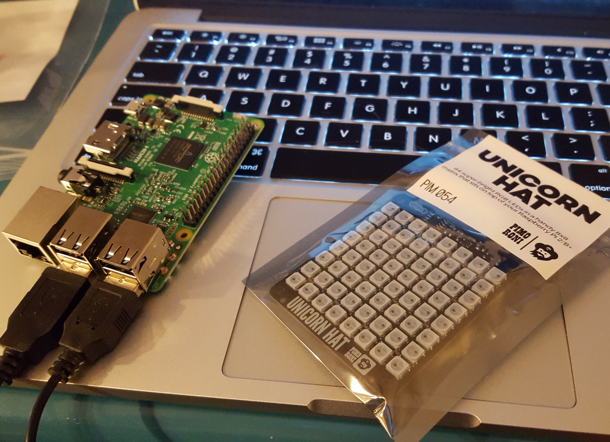

autoscale: true
footer: @stephaniecodes

# [fit] How not to read a room:

## [fit] Creating a socially awkward wearable

##  
##  

### Stephanie Nemeth

#### @stephaniecodes  ✨  stephanie.lol

[.hide-footer]

<!-- # Outline

- What you are seeing (& not seeing)
- Intent of project
- Reasons
  - ML learning at work
  - Everyone else learning fast
  - All theoretical no practical/tangible
  - ML4A & Coding Train
- About me
- Past work
- Building
  - long process
  - demotivated much of the time
  (https://twitter.com/stephaniecodes/status/1121499375778312193?s=20)
  - easy to hyperfocus and tweak one bit
- Process
  - Tensorflow on Rpi
  - Create LED necklace out of old LED pieces and arduino
  - Hookup Rpi to LEDs and send data to necklace
  - Change LED colors/pattern based on info from pi
- Tensorflowjs on Raspberry Pi
    - 1. can get tiny yolo model running in nodejs?
    (https://twitter.com/stephaniecodes/status/1091036862725218309?s=20)
    - 2. can get tensorflowjs running on pi?
        - at time, arm architecture not supported
        - yalc/build on pi was able to work
    - 3. can I get picamera working and sending pic to model?
- Creating the LED necklace
  - reuse and control blinkytiles with arduino (teensy) & fastled library
    (https://twitter.com/stephaniecodes/status/1095035804106309636?s=20)
  - design and solder blinkytiles necklace (https://twitter.com/stephaniecodes/status/1104838969202786304?s=20)
  - issues with flickering - fixing power issues by switching arduino
    (https://twitter.com/stephaniecodes/status/1113163809005371393?s=12)
    - power issues with teensy arduino, switch to metro mini (https://twitter.com/stephaniecodes/status/1113162729462861825?s=20)
- Hookup Rpi to LEDs and send data to necklace
  - issues
  (https://twitter.com/stephaniecodes/status/1107546342782574593?s=20)
  (https://twitter.com/stephaniecodes/status/1109896218736541696?s=20)
    - sending data from rpi to arduino (https://twitter.com/stephaniecodes/status/1113164378667462656?s=20)
- Writing light program for arduino & optimizing
  - Fixing memory issues / crashing on rpi (https://twitter.com/stephaniecodes/status/1145342670707003392?s=20) and blocking code on arduino program (https://twitter.com/stephaniecodes/status/1145316338329620480?s=20)
  - test fit off mannequin and issues (https://twitter.com/stephaniecodes/status/1153390413643862016?s=20) -->

---

# [fit] A very complicated necklace.

---

# [fit] A wearable that forces me 
# [fit] to be **AROUND PEOPLE** in order to
# [fit] **NOT** DRAW ATTENTION

---

### I'm introverted, awkward, and anxious in social situations.

---

### I wasn't keeping up with a machine learning study group at work.

^ I couldn't keep up with a machine learning study group at work that was doing a big MOOC course.

^ Everyone else learning fast
^ All theoretical no practical/tangible
^ ML4A & Coding Train

---

# I still have a lot to learn about Machine Learning.

- ML4A: [https://ml4a.github.io/](https://ml4a.github.io/)
 
- The Coding Train: [https://thecodingtrain.com/](https://thecodingtrain.com/)

---

software engineer, [@MicrosoftToDo](https://www.twitter.com/microsofttodo)

frontend  -  react  -  js  -  a11y

### ✨ Convo starters ✨
fashion  |  **vivienne westwood**  |  ootds

**bojack**  |  the heartshe, she holler

dogs named **Wilbur**

---

# [fit] It's Not my first hardware project

---

^ fiber optic whip kit

^ base is a flashlight with programmed programs

^ stitched to white dress sewn by my mom.

---

# Fiber optic dress

- No coding
- No soldering
- Fiber optic rave whip
- [tiny.cc/fiber-optic-kit](tiny.cc/fiber-optic-kit)

---

---

# Pixel Art on a Pi

- No soldering
- Lots of coding
    - Python
    - React
    - Socket.io
- [tiny.cc/rpi-project](tiny.cc/rpi-project)

---

---

# Haute Codeture

- Lots of Coding
    - React
    - MQTT
- Lots of soldering
- Lots of iterations
- [http://tiny.cc/haute-codeture](http://tiny.cc/haute-codeture)

---

---

- rpi pixel art in home
- haute codeture out and about with react app
- removing the need for connectivity for interactivity

---

# [fit] Building
  - long process
  - demotivated much of the time
  (https://twitter.com/stephaniecodes/status/1121499375778312193?s=20)
  - easy to hyperfocus and tweak one bit

---

# [fit] Process
  - Tensorflow on Rpi
  - Create LED necklace out of old LED pieces and arduino
  - Hookup Rpi to LEDs and send data to necklace
  - Change LED colors/pattern based on info from pi

---

# [fit] Tensorflowjs on Raspberry Pi

---

# [fit] Creating the LED necklace

---

# [fit] Hookup Rpi to LEDs and send data to necklace

---

# [fit] Writing light program for arduino & Optimization

---
