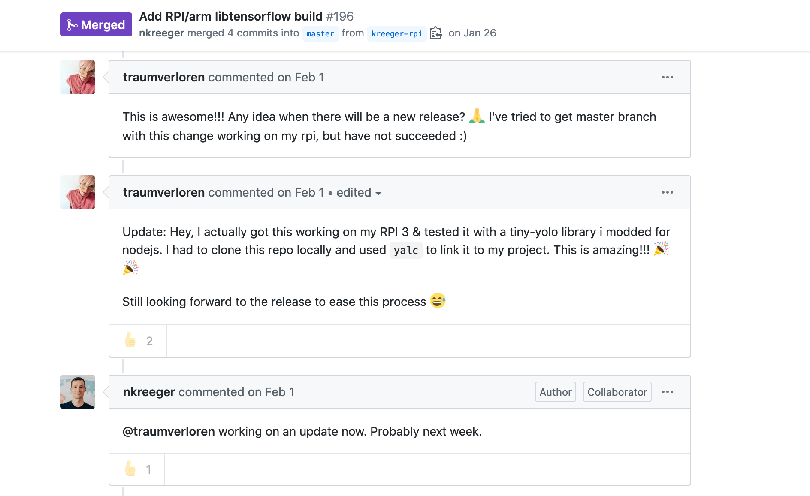

autoscale: true
footer: @stephaniecodes

# [fit] How not to read a room:

## [fit] Creating a socially awkward wearable

##  
##  

### Stephanie Nemeth

#### @stephaniecodes  ✨  stephanie.lol

[.hide-footer]

<!-- # Outline

- What you are seeing (& not seeing)
- Intent of project
- Reasons
  - ML learning at work
  - Everyone else learning fast
  - All theoretical no practical/tangible
  - ML4A & Coding Train
- About me
- Past work
- Building
  - long process
  - demotivated much of the time
  (https://twitter.com/stephaniecodes/status/1121499375778312193?s=20)
  - easy to hyperfocus and tweak one bit
- Process
  - Tensorflow on Rpi
  - Create LED necklace out of old LED pieces and arduino
  - Hookup Rpi to LEDs and send data to necklace
  - Change LED colors/pattern based on info from pi
- Tensorflowjs on Raspberry Pi
    - 1. can get tiny yolo model running in nodejs?
    (https://twitter.com/stephaniecodes/status/1091036862725218309?s=20)
    - 2. can get tensorflowjs running on pi?
        - at time, arm architecture not supported
        - yalc/build on pi was able to work (https://github.com/tensorflow/tfjs-node/pull/196)
        https://twitter.com/stephaniecodes/status/1091036862725218309
    - 3. can I get picamera working and sending pic to model?
- Creating the LED necklace
  - reuse and control blinkytiles with arduino (teensy) & fastled library
    (https://twitter.com/stephaniecodes/status/1095035804106309636?s=20)
  - design and solder blinkytiles necklace (https://twitter.com/stephaniecodes/status/1104838969202786304?s=20)
  - issues with flickering - fixing power issues by switching arduino
    (https://twitter.com/stephaniecodes/status/1113163809005371393?s=12)
    - power issues with teensy arduino, switch to metro mini (https://twitter.com/stephaniecodes/status/1113162729462861825?s=20)
- Hookup Rpi to LEDs and send data to necklace
  - issues
  (https://twitter.com/stephaniecodes/status/1107546342782574593?s=20)
  (https://twitter.com/stephaniecodes/status/1109896218736541696?s=20)
    - sending data from rpi to arduino (https://twitter.com/stephaniecodes/status/1113164378667462656?s=20)
- Writing light program for arduino & optimizing
  - Fixing memory issues / crashing on rpi (https://twitter.com/stephaniecodes/status/1145342670707003392?s=20) and blocking code on arduino program (https://twitter.com/stephaniecodes/status/1145316338329620480?s=20)
  - test fit off mannequin and issues (https://twitter.com/stephaniecodes/status/1153390413643862016?s=20) -->

---

# An Autonomous necklace

---

# [fit] Look at all this tech

- Camera
- Raspberry Pi
- Arduino
- LEDs
- Battery
- NodeJS
- TensorflowJS
- Tiny-YOLO
- FastLED

---

## [fit] *WHY* is just as important as *HOW*

---

# [fit] A wearable that forces me 
# [fit] to be *around people* in order to
# [fit] *not* DRAW ATTENTION

---

### I'm introverted, awkward, & anxious in social situations.

---

### [fit] It's Terrifying & counterinituitive, 

### but I'm fascinated with making myself uncomfortable in public

---

# [fit] Experiments with wearables

^ Over past couple years, I've made a couple of wearable projects to gradually explore wearing lighted wearables in public

^ How people react in general

^ How people react to me being the maker

^ How I react to people reacting

---

^ fiber optic whip kit

^ base is a flashlight with programmed programs

^ stitched to white dress sewn by my mom.

---

# Experiment #1: Jellyfish Dress

- Bought a kit: [tiny.cc/fiber-optic-kit](tiny.cc/fiber-optic-kit)
- Followed an Instructables tutorial
- No coding, pre-programmed
- No soldering, only sewing

---

## [fit] First time wearing lights 
## [fit] & people liked it!

---

## [fit] A Bit Lifeless

^ ~6 months coding experience
^ Next logical step was to actually code something

---

^ Multiple coordinated pieces
^ Anyone on the web could control the lights

---

# Experiment #2: Haute Codeture

- Lots of coding:
    - React, NodeJS, MQTT, Arduino
- Lots of soldering
- [tiny.cc/haute-codeture](http://tiny.cc/haute-codeture)

---

## People *really* liked controlling how I looked.

---

## *Limitations:*
## Dependent on wifi and an app

^ Stuck with keeping my phone on me, having a network connection

---

# Experiment #3: Speech-to-Image Necklace

- Some coding:
    - NodeJS
    - Google cloud speech recognition API
    - Google Custom Search API
- No soldering
- [tiny.cc/speech-to-image](http://tiny.cc/speech-to-image)

---

# [fit] Responsive without any direct input

# [fit] but needed wifi to work

---

# [fit] I accidently made something
# [fit] with *machine learning* & didn't realize it.

🤷‍

## (I just thought I was using an API)

---

# Making An Autonomous necklace

---

### I couldn't keep up with a machine learning study group at work.

^But  the real reason i built this is because I couldn't keep up with a machine learning study group at work that was doing a big MOOC course.

^ Everyone else learning fast
^ All theoretical no practical/tangible
^ ML4A & Coding Train

---

### Prove myself

### &

### Validate my learning style

---

software engineer, [@MicrosoftToDo](https://www.twitter.com/microsofttodo)

frontend  -  react  -  js  -  a11y

### ✨ Convo starters ✨
fashion  |  **vivienne westwood**  |  ootds

**bojack**  |  the heartshe, she holler

**dogs** | career changers

---

# How I learned some things

- Machine learning for artists  ✨  [https://ml4a.github.io/](https://ml4a.github.io/)
 
- The Coding Train  ✨  [https://thecodingtrain.com/](https://thecodingtrain.com/)

---

[.build-lists: true]

# Reality

<!--  -->

- Build time: 8 months vs. 3 months
- It was hard and I got demotivated
- I still know very little about machine learning
- I'm good at figuring out things I don't understand

^ demotivated alot of this year
^ easy to hyperfocus and tweak one bit

---

[.build-lists: true]

# Things to Accomplish

1. Get image recognition ML model running on **Node.js**
2. TensorFlow.js on **Raspberry Pi**???
3. Create a beautiful LED necklace
4. Send data from the Raspberry Pi to the necklace
5. Make the necklace responsive to data

---

# Things to Accomplish

1. Get image recognition ML model running on **Node.js**
 
 
 
 

---

# TensorFlow.js

Library for training & running machine learning models in the browser
(or Node.js)

^ it's mostly geared towards the browser

---

# Tiny-YOLO

**Y**ou **O**nly **L**ook **O**nce

 
- Pretrained model
- Fast **in-browser** image detection

---

Adapt Tiny-YOLO to work on Node.js

- Use `@tensorflow/tfjs-node`
- Store model files locally
- Modify `import`/`export` statements

---

# [fit] TensorFlow.js on Raspberry Pi

---

# [fit] Creating the LED necklace

---

# [fit] Hookup Rpi to LEDs and send data to necklace

---

# [fit] Writing light program for arduino & Optimization

---
