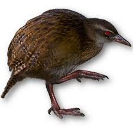
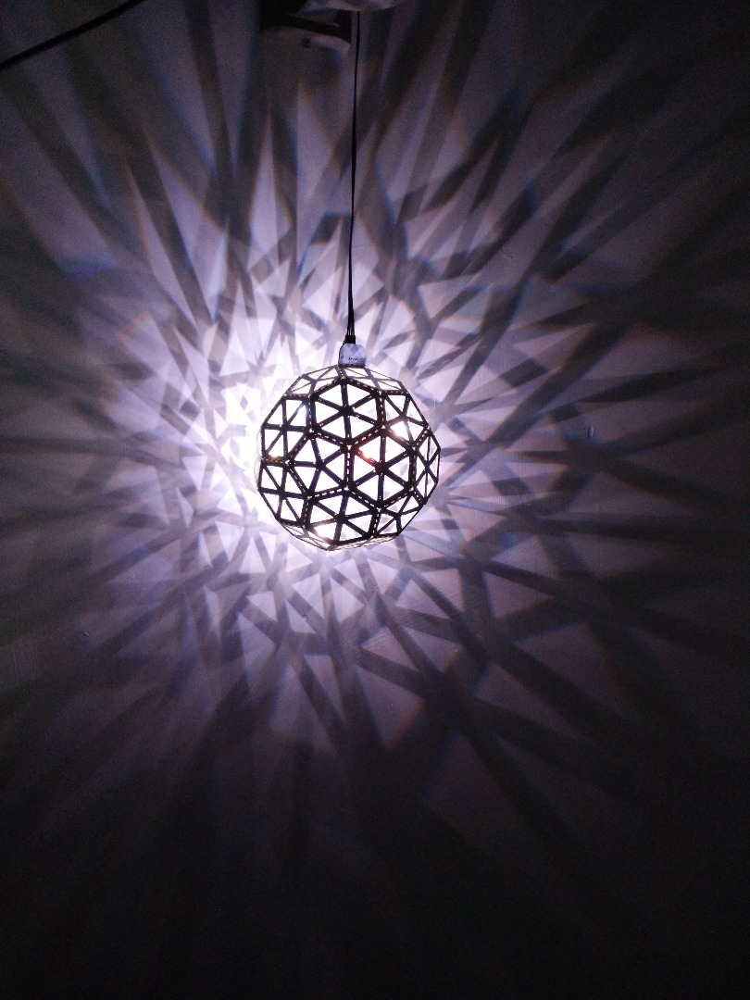

autoscale: true
footer: @stephaniecodes

# [fit] How not to read a room:

## [fit] Creating a socially awkward wearable

##  
##  

### Stephanie Nemeth

#### @stephaniecodes  ✨  stephanie.lol

[.hide-footer]

---

## Disclaimer:
## This is a tech talk about my necklace

^ next 40 minutes

^ using a lot of tech to respond people around me.

---

# [fit] Loaded with tech

| Hardware: | Software: |
| :--- | :--- |
| - Raspberry Pi | - NodeJS |
| - Arduino | - Tensorflow.js|
| - Camera | - C++
| - LEDs
| - Battery

^ Camera on choker

^ Camera is attached to rpi

^ RPI is running javascript & an image recognition model

^  ML model on the pi determines how many people it sees

^ sends info to an arduino.

^ The arduino is controlling the lights on the necklace.

^ it updates the colors and patterns of leds based on parameters i've set for how it should respond.

---
##### 

# Stephanie Nemeth

Software Engineer II

[@MicrosoftToDo](https://www.twitter.com/microsofttodo)

she/her

^ web dev

^ live in Berlin

^ my pronouns are she/her

---

### [fit] I'm *fascinated* with making beautiful things
### [fit] that make me *uncomfortable* in public

^ few yrs ago

^ started making lighted clothing

^ thought it beautiful.

^ Burden for me.

^ love them but hard to deal w/ the attention they draw

---

### [tiny.cc/fiber-optic-kit](tiny.cc/fiber-optic-kit)

 

^ the first project i ever made was...

^ festival

^ copied an instructables tutorial

^ bought a kit with preset light programs

^ sewed to a dress

---

## [fit] It was weird for me
## [fit] but people liked it

^ I felt awkward, but got lots of compliments.

^ try to channel that anxiety into a fascination & excitement

^ use them to confront my discomfort of the attention they attract.

^ Self-esteem boost.

^ wished it could be more alive & interactive

---

### I found inspiration at the Stedelijk.

#                               

^Stedelijk museum in Amsterdam

^I went to see an exhibition of art by Jean Tinguely.

---

### Jean Tinguely

#                                 

^ Jean Tinguely

^ Swiss, 60s/70s

^ Art NOT about standing in a sterile white space, distantly gazing silent painting

^ Art meant to be playful

^ Created installations meant to be triggered by a viewer

^ The viewers's experience was integrated into the overall effect of the work itself

^ It intentionally blurred the line between artist and viewer

^ The viewer is invited to choose a drawing tool (marker, pen, or pencil) and place it in a holder.

^ When put into motion, it moves it along a piece of paper.

^ The result would be a work of art in itself.

^ No longer just watching a process, the viewer, by choosing the drawing tool, plays a role in the creation of an entirely new work of art.

---

> I wanted something ephemeral that would pass like a falling star...  The work had to just transpire, make people dream and talk, and that would be all.
> - Jean Tinguely

^ At the exhibit, this quote by Tinguely stood out to me.

^ Really liked idea of art as a temporary experience that connects an artist and viewer

^ It's spontaneous and,

^ Only meant to bring joy and inspire for short time

---

### [tiny.cc/haute-codeture](http://tiny.cc/haute-codeture)

 

^ inspired

^ purposefully wanted to explore creating a temporary experience that connected strangers to me through my outfit.

^  app to control the lights

^ Anyone on the web could change colors and patterns

^ Lots of coding: React, NodeJS, MQTT, Arduino

^ Lots of soldering

---

## [fit] a web app for your outfit is
## [fit] both good and bad

^ question who is the artist in that moment?

^ Explored the interactions that might occur when people realize it's interactive via app.

---

<!-- [.build-lists: true] -->

## [tiny.cc/speech-to-image](http://tiny.cc/speech-to-image)

- Raspberry Pi 3B+
- Microphone
- Touchscreen
- NodeJS
- Google cloud speech recognition API
- Custom google search API

^ More interested: responsive to what i was experiencing

^ rather than input from others

^ built this to see if people would pay attn to me more when i spoke.

^ NodeJS server sends audio to google speech recognition api

^ gets  keywords

^ sends google search api from and finally is showing an image that correlates to what i'm saying.

---

# [fit] I accidently made a thing
# [fit] with *machine learning*
# [fit] and hadn't realize it.

 🤷‍

### (I just thought I was using an API)

^ Ironically I also didn't realize I had worked with ML in this project until I really looked back and thought about this project again.

^ ML is so pervasive

^ used it here

^  Just thought I using an API that I sent data to and got a response.

---

^ take this concept of wearable responsive to me but built to be viewed by those around me

^ responsive to people around me but increases my discomfort unless i conform to social norms

^ obnoxious, flashy, attention getting when alone

^  only calm when sociable & surround with other people.

^ less about purposefully using lights to attract people

^ more about me wanting to get rid of the lights as fast as possible

^ this progression of my work is a convincing reason for me to build this necklace

^ misled you

---

### New Job at big tech company

^ moment of self-doubt & inadequacy

^ yr ago, new job at a big tech co

^ felt really insecure with my skills

^ folks started a ML study group

^ falling behind from the first study group

^ i wanted to prove that i could learn all these concepts in my own style.

^ create a physical use case for ML that was relevant to me and my interests

^ the real reason i built this is because I couldn't keep up with a ML study group at work.

---

^ the ML 4 artist courses by gene kogan

^ open my eyes to what artists and non-traditional technologists doing

^ they gave me ideas on how i could integrate ml into a new wearable project

---

 

Wekinator

 

Open Frameworks

^ ML4A introduced me to GUI tools

^ I could quickly play with integrating ML into one of my wearables

---

[https://code.google.com/archive/p/wekinator/](https://code.google.com/archive/p/wekinator/)

^ Wekinator builds these models using supervised machine learning algorithms. Instead of creating the model function by writing code, you create models by providing training examples of inputs and the outputs that should correspond to them. A learning algorithm builds a model from the training examples.

^ But i wanted to code it

---

^ i wanted to do all the machine learning in JS -> Tensorflow.js

^ Library for training & running machine learning models in the browser
(or Node.js)

^ browser not possible on rpi

^ There were 2 things i wasn't sure from beginning if they were even possible:

^ 1. running ml models in node instead of browser

^ 2. run ml models in node on a rpi

---

# Tiny-YOLO

## *Y*ou *O*nly *L*ook *O*nce

 
 Fast **in-browser** image detection

^ Pre-trained model

---

# [fit] Adapt Tiny-YOLO to work on Node.js

- Use `@tensorflow/tfjs-node`
- Store model files locally
- Modify `import`/`export` statements
- Load image file vs. `MediaDevices.getUserMedia()`

 

[tiny.cc/yolo-pi](http://tiny.cc/yolo-pi)

^ lots of minor code changes to do to run browser based models in node instead.

^ can see in the console statements detecting person

---

1. ~~Get image recognition ML model running on Node.js~~
2. **Run TensorFlow.js on Raspberry Pi!**
 
 
 

---

^ i got really lucky that the tf.js team had just made a change for this

^ but released build yet

---

^ i needed to build it locally on my pi from their commit, but it worked, never did that, but it!

---

# [fit] Disclaimer: I'm running on Tensorflow.js 0.14.2

It is a bit hacky, but runs reliable & that's beautiful!

If it isn't broke, why fix it?

^ Latest tf.js release is 1.5.2

^ Also prepping rc 2.0

^ I did this months ago and honestly don't wanna mess it up

---

<!--  -->

<!-- 

--- -->

1. ~~Get image recognition ML model running on Node.js~~
2. ~~Run TensorFlow.js on Raspberry Pi!~~
4. **Create a LED necklace**
 
 

---

# [fit] Reuse hardware and materials I already had

^ fully contained kit with own custom microcontroller with preprog light programs

---

<!--  -->
 

^ what most people build

^ already experimented with creating a wearable

---

 Control blinkytiles with an arduino

[https://github.com/jasoncoon/BlinkyTileFastLED](https://github.com/jasoncoon/BlinkyTileFastLED)

^ try follow this example code

---

^ control as dmx / stage lighting

---

---

---

1. ~~Get image recognition ML model running on Node.js~~
2. ~~Run TensorFlow.js on Raspberry Pi!~~
3. ~~Create a LED necklace~~
4. **Send image data from the Raspberry Pi to the lights**

^ Communication between the Raspberry Pi and the arduino

---

<!-- # [fit] Communication between the
# [fit] Raspberry Pi and the arduino -->

<!-- --- -->

^ Useful for low level communication

^ One for sending, one for receiving

^ Send data from Pi to data pin on Arduino

---

^ i had a lot of trouble with this!

^ loopback

---

<!-- 

--- -->

^ updating pi config files

^ disable some config settings on boot

---

# [fit] but I had bugs that were really bad

---

# [fit] Issues on necklace

^ Kinda learns about electronics as I build stuff and have problems?

^ Power issues

^ So switched boards

---

^ Teensy 3.3V, 5V tolerant

^ Metro Mini 5V output

^ Blinkytiles need 5V

^ I had one lying around

^ Learned what my issue was after the fact

---

# [fit] Raspberry Pi Crashing

^ monitor with htop

---
[.build-lists: true]

# Remember this project?

---

# [fit] it was still running at startup
# [fit] & HAD A MEMORY LEAK
# 
# 🤦‍

---

# [fit] What format do I use to send data?

---

# [fit] ‍I use json everywhere else,
# [fit] I'll use JSON here

---

[.build-lists: true]

# JSON on Arduino is a thing!

^ Hey, there's an Arduino JSON library

^ Wow, it worked!

---

# [fit] But this was a bad decision

^ Lights would pause while processing the JSON received

^ arduino is single threaded and very limited resources

^ thought i was clever for using json

---

^ what info does the arduino really need

^ what can it be condensed down to

^ updated code from the NodeJS/rpi App

^ 60 & 62

---

1. ~~Get image recognition ML model running on Node.js~~
2. ~~Run TensorFlow.js on Raspberry Pi!~~
3. ~~Create a LED necklace~~
4. ~~Send image data from the Raspberry Pi to the lights~~
5. **Program the lights to change based on # of people around**

---

# [fit] Non-javascript stuff
### (Write a bunch of C++ on arduino)

---

^ get a message, get peopleCount, update program

---

^ get a message, get peopleCount, update program

---

[tiny.cc/ml-necklace](http://tiny.cc/ml-necklace)

---

^ poor fit

^ didn't consider how to "hide" rpi, battery pack on body.

^ poorly soldered, bad connections shorting

^ TLDR, Don't wait to the end to actually wear on you, not just your mannequin

---

^ first idea was to stuff everything in a fanny pack but that was not working.

^ too much stuff, too big

---

### [fit] Sometimes, I've had enough attention

## 

## 😖 😩 😫

^ I decided to add one more feature I hadn't planned for

^ button

^ a way to turn off the lights completely

---

^ experiment with ability to flip how the necklace responds

^ so it would be calm with no one around and chaotic with many people around

---
<!--

--- -->

^ i know can sound straightforward what i did when i condense it down in a talk

^ it was hard and i got demotivated

^ 8mos vs. 3mos

^ always stuff i could have done differently

---

> I wanted something ephemeral that would pass like a falling star...  The work had to just transpire, make people dream and talk, and that would be all.
> - Jean Tinguely

^ end with this quote. This is what i've tried to do thru out all my wearables

^ fuels me to explore ways to make myself uncomfortable in order to find new ways to interact with others

^ hope i've inspired you for a bit, or at least given you something interesting to look at for 40mins

---

# Thanks!

- Tensorflowjs + tiny-yolo + Raspberry Pi code:
[tiny.cc/yolo-pi](http://tiny.cc/yolo-pi)

 

- Arduino necklace code:
[tiny.cc/ml-necklace](http://tiny.cc/ml-necklace)
