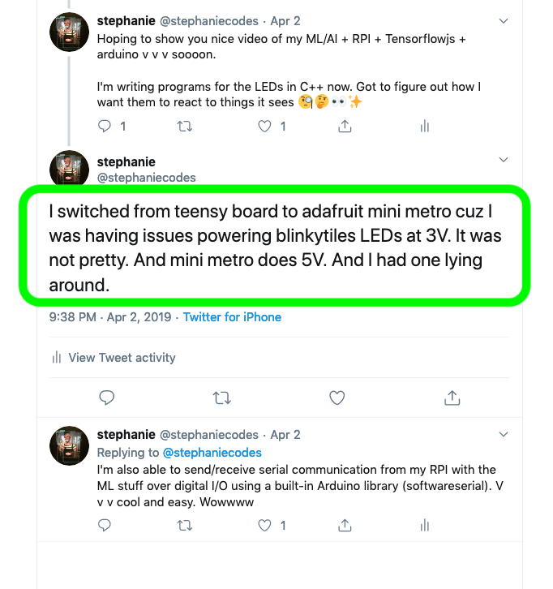

autoscale: true
footer: @stephaniecodes

# [fit] How not to read a room:

## [fit] Creating a socially awkward wearable

##  
##  

### Stephanie Nemeth

#### @stephaniecodes  ✨  stephanie.lol

[.hide-footer]

---

# An Autonomous necklace

---

# [fit] Look at all this tech!

| Hardware | Software |
| :--- | :--- |
| Camera | NodeJS |
| Raspberry Pi | TensorflowJS|
| Arduino | C++
| LEDs
| Battery

---

## [fit] *WHY* is just as important as *HOW*

---

# [fit] A wearable that forces me 
# [fit] to be *around people* in order to
# [fit] *not* DRAW ATTENTION

---

### I'm a bit introverted, awkward & anxious in social situations.

---

### [fit] I'm *fascinated* with making myself 
### [fit] uncomfortable in public

^It's terrifying & counterinituitive but

---

# [fit] Earlier experiments with wearables

^ Over past couple years, I've made a couple of wearable projects to gradually explore wearing lighted wearables in public

^ How people react in general

^ How people react to me being the maker

^ How I react to people reacting

---

^ fiber optic whip kit

^ base is a flashlight with programmed programs

^ stitched to white dress sewn by my mom.

---

# Experiment #1: Jellyfish Dress

- Bought a kit: [tiny.cc/fiber-optic-kit](tiny.cc/fiber-optic-kit)
- Followed an Instructables tutorial
- No coding, pre-programmed
- No soldering, only sewing

---

## [fit] First time wearing lights 
## [fit] & people liked it!

---

## [fit] A Bit Lifeless

^ ~6 months coding experience
^ Next logical step was to actually code something

---

^ Multiple coordinated pieces
^ Anyone on the web could control the lights

---

# Experiment #2: Haute Codeture

- Lots of coding:
    - React, NodeJS, MQTT, Arduino
- Lots of soldering
- [tiny.cc/haute-codeture](http://tiny.cc/haute-codeture)

---

## People *really* liked controlling how I looked.

---

## *Limitations:*
## Dependent on wifi and an app

^ Stuck with keeping my phone on me, having a network connection

---

# Experiment #3: Speech-to-Image Necklace

- Some coding:
    - NodeJS
    - Google cloud speech recognition API
    - Google Custom Search API
- No soldering
- [tiny.cc/speech-to-image](http://tiny.cc/speech-to-image)

---

# [fit] Responsive without any direct input

# [fit] but needed wifi to work

---

# [fit] I accidently made something
# [fit] with *machine learning* & didn't realize it.

🤷‍

## (I just thought I was using an API)

---

software engineer, [@MicrosoftToDo](https://www.twitter.com/microsofttodo)

frontend  -  react  -  js  -  a11y

### ✨ Convo starters ✨
fashion  |  **vivienne westwood**  |  ootds

**bojack**  |  the heartshe, she holler

**dogs** | career changing

---

# Making An Autonomous necklace

^ rest of the talk I want to talk through how i built this and the different tech challenges i faced

---

### I couldn't keep up with a machine learning study group at work.

^But  the real reason i built this is because I couldn't keep up with a machine learning study group at work that was doing a big MOOC course.

^ Everyone else learning fast
^ All theoretical no practical/tangible
^ ML4A & Coding Train

---

---

---

### Prove myself

### &

### Validate my learning style

---

# [fit] It was hard and
# [fit] I got demotivated

^ Build time: 8 months vs. 3 months

---

# [fit] I still know very little 
# [fit] about machine learning

---

# [fit] I'm good at figuring out things
# [fit] I don't understand

^ demotivated alot of this year
^ easy to hyperfocus and tweak one bit

---

<!-- [.build-lists: true]

# Autonomous Necklace Recipe

1. Get image recognition ML model running on **Node.js**
2. Run TensorFlow.js on **Raspberry Pi!**
3. Send camera pic to image recognition model on Raspberry Pi
4. Create a LED necklace
5. Send image data from the Raspberry Pi to the necklace
6. Make the necklace responsive to data

--- -->

# Autonomous Necklace Recipe

1. Get image recognition ML model running on **Node.js**
 
 
 
 

---

# TensorFlow.js

^ Library for training & running machine learning models in the browser
(or Node.js)

^ it's mostly geared towards the browser

---

# Tiny-YOLO

## *Y*ou *O*nly *L*ook *O*nce

- Pretrained model
- Fast **in-browser** image detection

---

# [fit] Adapt Tiny-YOLO to work on Node.js

- Use `@tensorflow/tfjs-node`
- Store model files locally
- Modify `import`/`export` statements
- Load image file vs. `MediaDevices.getUserMedia()`

---

# Autonomous Necklace Recipe

1. ~~Get image recognition ML model running on **Node.js**~~
2. Run TensorFlow.js on **Raspberry Pi!**
 
 
 
 

---

---

---

### [fit] FYI: I'm running on Tensorflow.js 0.14.2

It is a bit hacky, but runs reliable & that's beautiful!

 

If it ain't broke, don't fix it?

^ I did this months ago and honestly don't wanna mess it up

^ Latest tf.js release is 1.2.8

^ Also prepping rc 2.0

---

# Autonomous Necklace Recipe

1. ~~Get image recognition ML model running on **Node.js**~~
2. ~~Run TensorFlow.js on **Raspberry Pi!**~~
3. Send camera pic to image recognition model on Raspberry Pi
 
 
 

---

# [fit] Send camera pic to image recognition model on Raspberry Pi

- Hookup PiCamera 
- Use `node-canvas` & create a canvas for the pic
- Crop image to match what model expecting (416 x 416)
- Turn into a tensor & send to the model!

---

---

# Autonomous Necklace Recipe

1. ~~Get image recognition ML model running on **Node.js**~~
2. ~~Run TensorFlow.js on **Raspberry Pi!**~~
3. ~~Send camera pic to image recognition model on Raspberry Pi~~
4. Create a LED necklace
 
 

---

# [fit] Reuse hardware and materials I already had

---

---

 Use the blinkytiles but control them with an arduino

[https://github.com/jasoncoon/BlinkyTileFastLED](https://github.com/jasoncoon/BlinkyTileFastLED)

---

---

---

# Autonomous Necklace Recipe

1. ~~Get image recognition ML model running on **Node.js**~~
2. ~~Run TensorFlow.js on **Raspberry Pi!**~~
3. ~~Send camera pic to image recognition model on Raspberry Pi~~
4. ~~Create a LED necklace~~
5. Send image data from the Raspberry Pi to the necklace

---

# [fit] Physically connect the 
# [fit] Raspberry Pi to the necklace

---

<!-- # [fit] Serial Pins on Raspberry Pi -->

^ Useful for low level communication
^ One for sending, one for receiving
^ Send data from Pi to data pin on Arduino

---

---

---

^ updating pi config files
^ disable some config settings on boot

---

# [fit] Glitchy:
# [fit] Oh nooooo!

^ long wires
^ 5V tolerant, but with a bit of modification
^ Outside my abilities at the time
^ So switched boards instead

---

<!-- ## I switched boards -->

---

---

# [fit] Send Data to Necklace

---

# [fit] But What format do you do this stuff in???? 

---

# [fit] ‍I use json at work,
# [fit] I'll use JSON here

---

[.build-lists: true]

# Is JSON on Arduino a thing?

^ Hey, there's an Arduino JSON library

^ Wow, it worked!

---

# [fit] But this was a bad decision

---

^ Lights would pause while processing the JSON received

^ Oops, that didn't work so well

---

^ this is code in the NodeJS App
^ what info does the arduino really need
^ what can it be condensed down to
^ 60 & 62

---

---

^ actually started writing the C++ for the light programs at end of June

---

# [fit] Non-javascript stuff
# [fit] Write a bunch of C++ code for light programs

---

# todo: show some c++ code for logic

---

^ Don't wait to the end to actually wear it

---

^ first idea was to stuffy everything in a fanny pack but that was not working.

^ too much stuff, too big

---

# button ring

---

---
